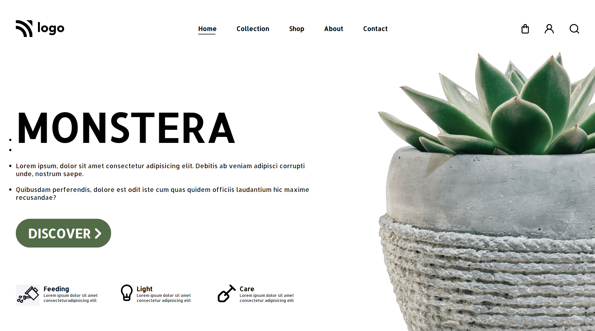

## Manideep Paul 

 

I was strugling to set the `#imgMain` size and put the image such that it always touch bottom of the webpage. First problem solved using `max-width` and one solved using `flex-box` and setting the height of the body to `100vh`.

- It took me around **4 hour** to complete the project.

 

### Live link

- [Click me](https://live-class-project-06.vercel.app/) to view the project.

 

**Used in Project**

 

### Preview

